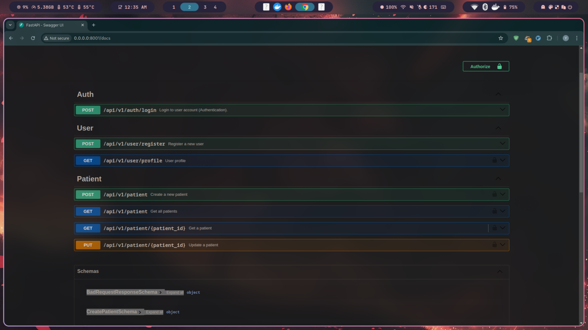

# Project Setup Guide

## Local Setup Instructions

1. Set `.env` file using `.env.example` (for Docker) or `src/apps/.env.example` (for local setup).

### Method 1: Using Virtual Environment

1. Clone the repository:

   ```bash
   git clone https://github.com/GreatTeapot/Task1-MadDevs.git Project
   cd Project
   ```

2. Create and activate a virtual environment:

   ```bash
   python3 -m venv .venv
   source .venv/bin/activate  # On Windows: .venv\Scripts\activate
   ```

3. Install dependencies:

   ```bash
   pip install -r src/apps/requirements.txt
   ```

4. Make migrations:

   ```bash
   make migrate
   ```

5. Run the application:

   ```bash
   make run
   ```

   Access the application at:

   ```
   http://127.0.0.1:8000/docs
   ```

### Method 2: Using Docker

1. Clone the repository:

   ```bash
   git clone https://github.com/GreatTeapot/Task1-MadDevs.git Project
   cd Project
   ```

2. Build and start the application:

   ```bash
   make build
   make up
   ```

   Access the application at:

   ```
   http://0.0.0.0:8001/docs
   ```

3. Stop the application without removing containers:

   ```bash
   make stop
   ```

4. Stop the application and remove containers:

   ```bash
   make down
   ```

## Running Tests

Run the test suite with the following command:

```bash
make test
```

## Project Structure

```
project-directory
├── src
│   ├── apps
│   │   ├── other*        # Application code
│   │   ├── tests/       # Unit tests and integration tests
│   │   ├── migrations/  # Database migration files
│   │   └── requirements.txt  # Project dependencies
├── docker-compose.yml   # Docker configuration file
├── Makefile             # Automation commands (build, run, test, etc.)
└── README.md            # Project documentation
```

## Swagger UI Overview

The application comes with an interactive API documentation powered by Swagger UI. After starting the application, you can access it at:

- **Virtual Environment:** `http://127.0.0.1:8000/docs`
- **Docker:** `http://0.0.0.0:8001/docs`

Screenshot:


